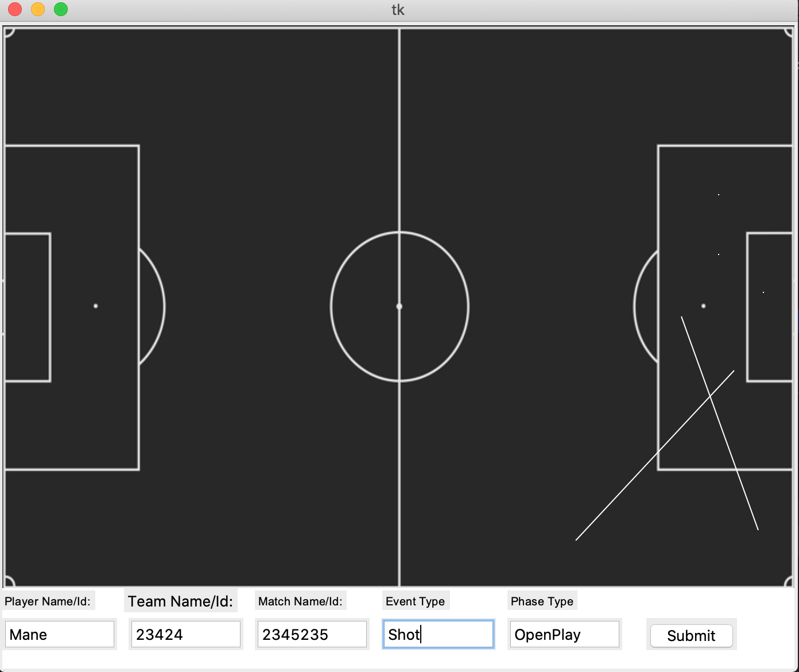
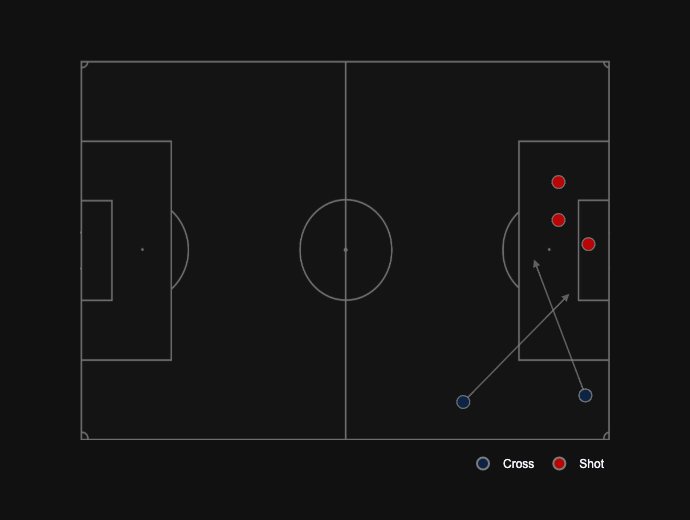

# FootballDoodling

## Overview

* `FootballDoodling` helps you to manually graph match events and export the results in csv format

* Below are some tips and examples on how to use `FootballDoodling` to draw event graphs
  
## Usage

Running the script is quite simple and can be done via any IDE or other preferred Python working environment. Upon running the script the user will be presented with
a window which includes several textboxes. The only mandatory textbox to fill out is the Event Type textbox. The current version is also picky about which Event Types can be
entered. Everything is allowed but if you want to plot events which have arrow annotations then those need to be declared in the code as such. Currently the annotated
events are 'Cross', 'Pass', 'SetPlay', and 'Corner'. These events also require the user to single-click and drag (from starting point to endpoint) to create an annotation. 
All other events will be single marker plots and require the user to use a double-click to enter them as a dot/marker on the plot.  If you want additional event types then 
just add them to the code as you see fit. Support to export to csv will be added very shortly.

## Examples

Here is an example showing the initial interface:

Here is an example of the final graph:

